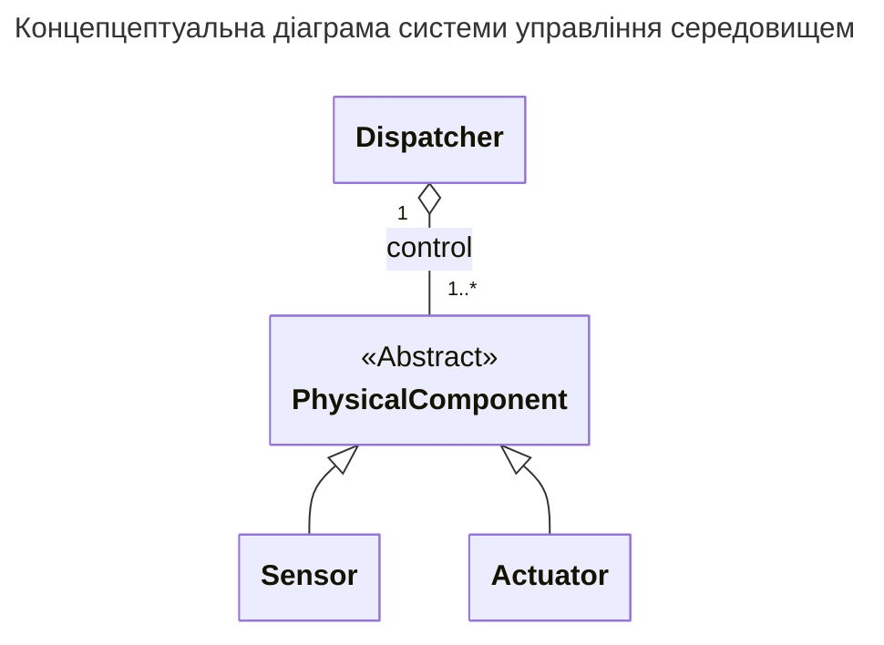

# 00 Наскрізний приклад

%% Insert text %%
**Система управління середовищем** є програмною системою, яка взаємодіє з власним середовищем через
- датчики (*sensors*) та
- виконавчі механізми (*actuators*)

задля забезпечення певної поведінки середовища, яка визначається логікою
- контролера (*dispatcher*).



**Система управління середовищем** є прикладом *[[Що таке кіберфізична система#^998574|кіберфізичної]]*, точніше *[[Що таке кіберфізична система#^36a1d6|вбудованої]]*, системи.
## Чернетки

```dataviewjs
let pages = dv.pages().where(p => p.file.outlinks.some(l => l.path.includes("00 Наскрізний приклад.md")));

if (pages.length > 0) {
//    dv.header(3, "Нотатки, що посилаються на '00 Наскрізний приклад'");
    dv.list(pages.map(p => p.file.link));
} else {
    dv.paragraph("Не знайдено нотаток, які посилаються на '00 Наскрізний приклад'.");
}
```

## Зміст

1. [[Що таке кіберфізична система|Що таке кіберфізична система?]]