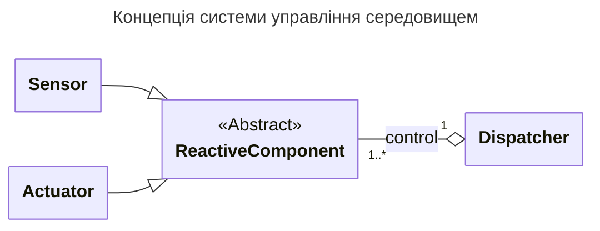

# 00 Наскрізний приклад

%% Insert text %%

```mermaid
---
title: Концепція системи управління середовищем
config:
  class:
    hideEmptyMembersBox: true
---
classDiagram
direction LR

	class Sensor
	class Actuator
	class ReactiveComponent {
	    <<Abstract>>
	}
	
	Sensor --|> ReactiveComponent
	Actuator --|> ReactiveComponent
	class Dispatcher
	
	ReactiveComponent "1..*" --o "1" Dispatcher : control
```
