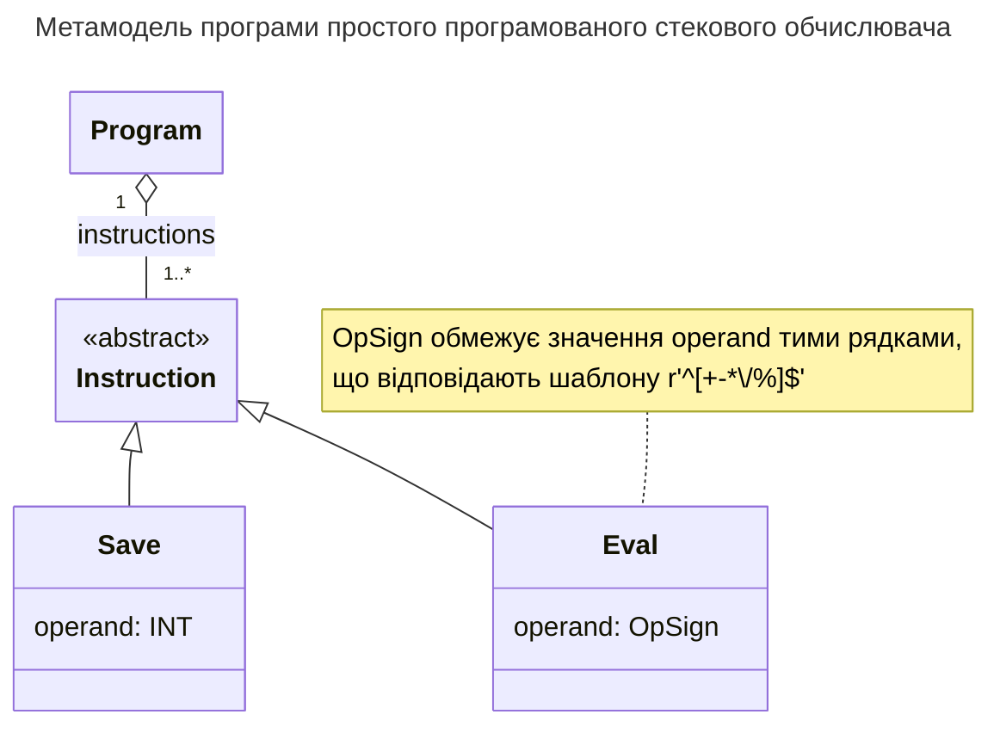

# Arithmetics. Метамодель мови простого програмованого стекового обчислювача

## Контекст нотатки

- [[Arithmetics]]
%%
- maybe other reference
%%
## Зміст нотатки

```textx
Program:
    instructions+=Instruction
; 

Instruction: Save | Eval;

Save:
    'save' operand=INT
;

Eval:
    'eval' operand=OpSign
;

OpSign: /[-+*\/%]/;
```


