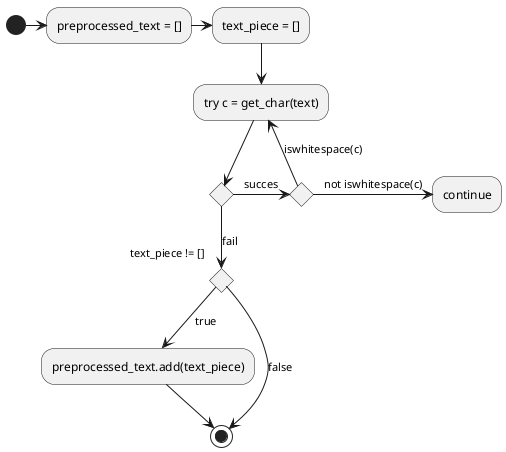

----
Перейти до [[INDEX|ЗМІСТУ]]

----
<H1>Первинна обробка тексту</H1>

Первинна обробка тексту забезпечує перетворення тексту `text: str`, на об'єкт типу `preprocessed_text: list[str]`, який задовольняє наступним умовам:
1. кожний елемент вихідного списку не містить жодного пробільного символу;
2. якщо об'єднати елементи вихідного списку в текстовий рядок у такий спосіб `"".join(preprocessed_text)`, то буде отриманий рядок, що співпадає з первинним текстом, з якого видалили пробільні символи;
3. якщо елемент вихідного списку містить знак, то всі символи цього елементу є знаками.

 