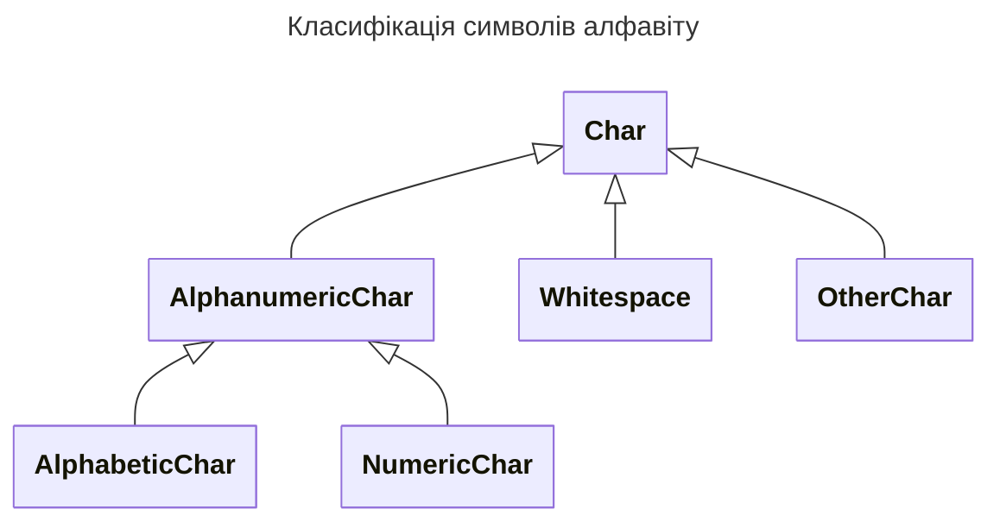

# Алфавіт

## Контекст нотатки

- [[Базові поняття]]
%%
- maybe other reference
%%
## Зміст нотатки

Конструкції формальних мов будуються як скінченні послідовності (_ланцюжки_) **символів (characters) алфавіту**.

З **теоретичної точки зору**, символи, можуть бути елементами будь-якої скінченної множини, яка і зветься **алфавітом**. Важливою характеристичною властивістю цієї множини є наявність методу надійно розрізняти її елементи, які, до того ж, вважаються _атомарними_, тобто позбавленими будь-якої структури.

З **практичної точки зору**, символи представляються полями бітів у відповідності до кодових таблиць таких як [***ASCII*** (*American Standard Code for Information Interchange*)](https://uk.wikipedia.org/wiki/ASCII) або [***Unicode***](https://uk.wikipedia.org/wiki/%D0%AE%D0%BD%D1%96%D0%BA%D0%BE%D0%B4).

В практичних застосуваннях символи зазвичай класифікуються у наступний спосіб:

Ця класифікація є умовною і змінюється від мови до мови.
