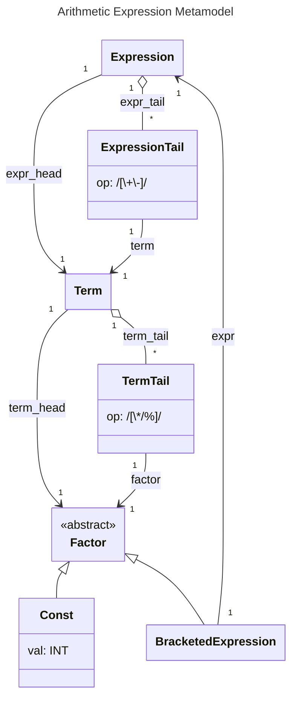

# Метамодель проєкту Arithmetics

## Контекст нотатки

- [[Проєкт Arithmetics]]
%%
- maybe other reference
%%
## Зміст нотатки

```python
// Головне правило: модель складається з одного виразу

// Вираз є послідовністю не менше ніж одного термів, між кожними двома сусдніми
// з яких стоїть або знак операції '+', або знак операції '-'.

Expression:
    expr_head=Term
    expr_tail*=ExpressionTail
;

ExpressionTail:
    op=MatcherPlusOrMinus
    term=Term
;

MatcherPlusOrMinus: /[+-]/;

// Терм є послідовністю не менше ніж одного термів, між кожними двома сусдніми
// з яких стоїть або знак операції '*', або знак операції '/',
// або знак операції '%'.

Term:
    term_head=Factor
    term_tail*=TermTail
;

TermTail:
    op=MatcherMultOrDivOrMod
    factor=Factor
;

MatcherMultOrDivOrMod: /[*\/%]/;

// Фактор є або цілою константою, або виразом в дужках.

Factor: Const | BracketedExpression;

Const: val=INT;

BracketedExpression: '(' expr=Expression ')';
```



